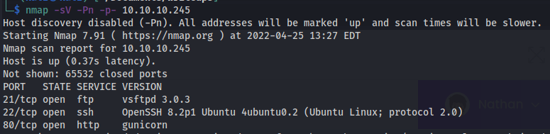
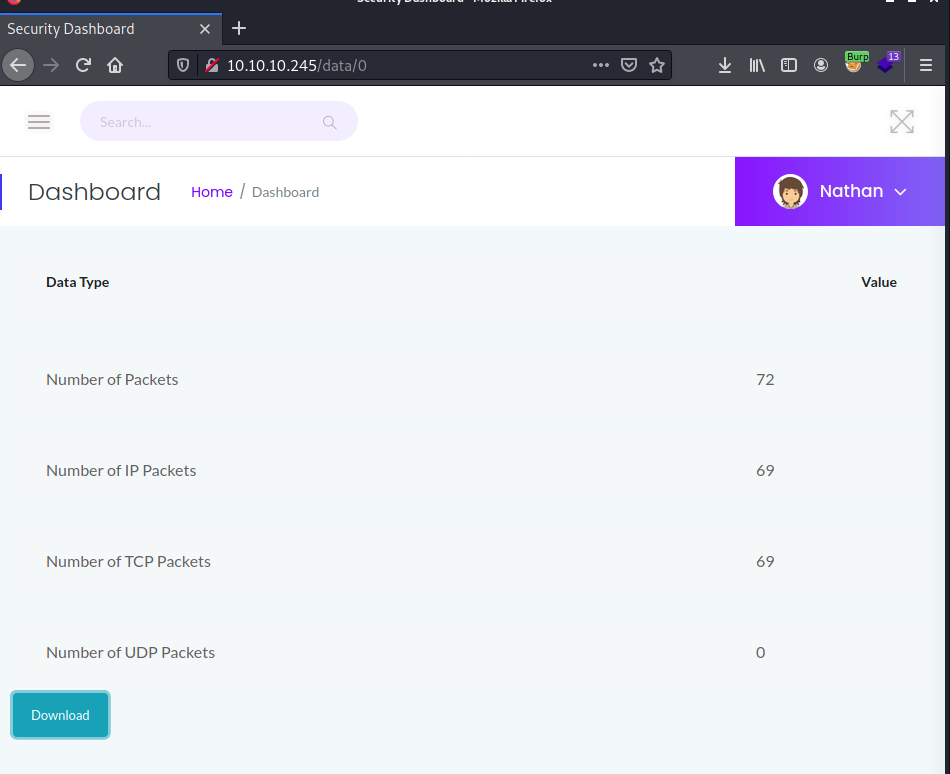
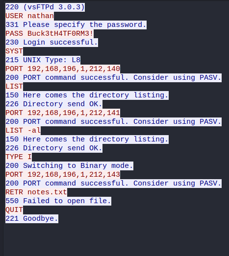
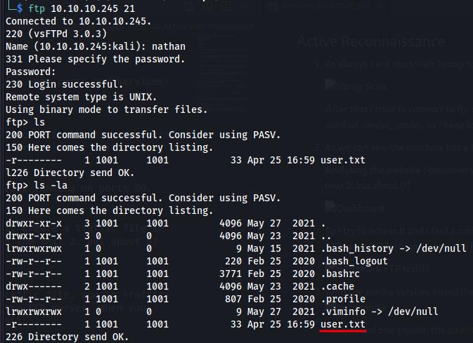

 
# HackTheBox - [Cap](https://app.hackthebox.com/machines/Cap)
- Date - 04/26/2022
- Difficulty - EASY
- OS - Linux

## Tools
 - Nmap
 - Wireshark
 - [LinPEAS](https://github.com/carlospolop/PEASS-ng/tree/master/linPEAS)

## Recon

1) As always I will start with Nmap to scan for open ports and services:

    

    *After that I tried to connect to ftp service with the **anonymous** user and **without** password and it not worked :sweat_smile:, so I keep looking for something.*

2) As we can see, the machine has a HTTP service running on ports 80.  
    

    Analysing the website I disconvery that it create a traffic file in the path ```/data/``` and start with 1 and the next 2. but about 0? 
    
    
    
    So I try to access it and I find a odd traffic file, and in traffic has nathan authentication to access the FTP server. 
    
    

## Initial Compromise

1) When you access the FTP you will see the **user flag**!!

    

2) Now, I try to access via SSH with the nathan authentication as the FTP and work it!

## Internal Recon


1) I used the linPEAS script to check for privilege escalation vectors.

    The report is found an interesting file belonging to nathan, ```app.py```. When I analyse the file I discovery that is the file of the webapp in Python3 and that is running ```os.setuid()```, so I just try to use it to privilege escalation to root.

## Privilege Escalation

I created the script above to switch to user root. Its calls ```os.setuid()``` with UID 0. 

*The root account always have the UID/GID 0/0 on Linux.*

````
python3
import os
os.setuid(0)
os.system("/bin/bash")
````

 
And work it! Now we can get the ```root.txt``` flag.