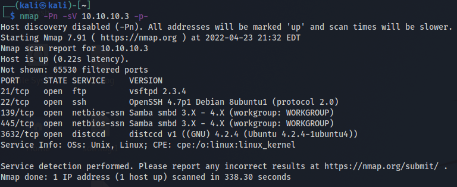
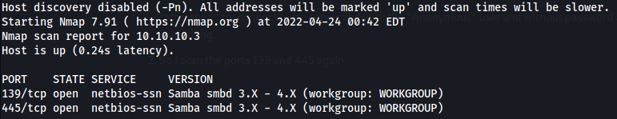
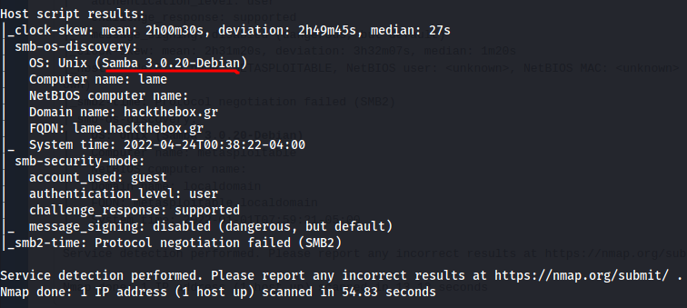
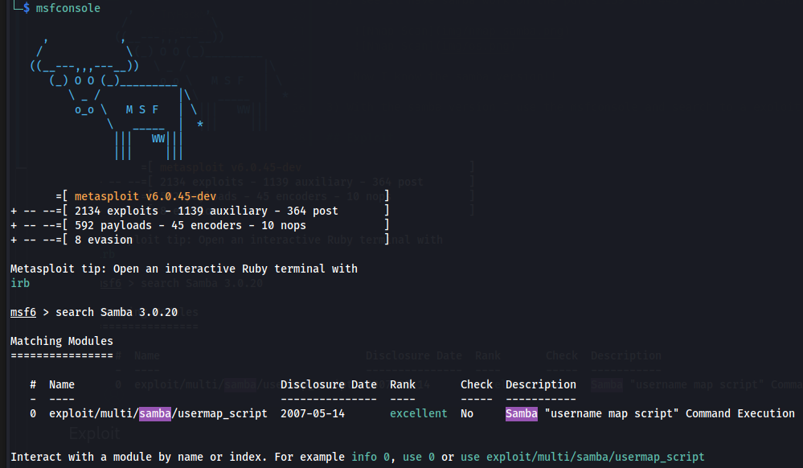
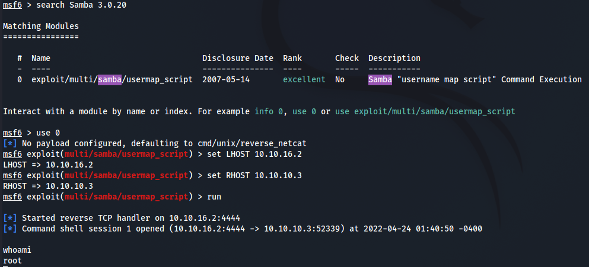

 
# HackTheBox - [Lame](https://app.hackthebox.com/machines/Lame)
- Date - 04/24/2022
- Difficulty - EASY
- OS - Linux
## Tools
 - Nmap
 - Metasploit framework

## Active Reconnaissance

1) As always I will start with Nmap to scan for open ports and services:

    

    *After than I tried to connect to ftp service with the **Anonymous** user and **without** password and it worked :satisfied:!! But I couldn't find any utils :sweat_smile:, so I keep looking for something.*

2) As we can see it has samba working on ports 139 and 445, so I will scan again these ports:

    
    

    Now I know the samba version!

3) With the samba version, I used the **Metasploit framework** and searched for an exploit for this version.
    

    I only found one exploit, the ```usermap_script```, now we will try to use it.

## Exploit

To exploit it we need to set ```LHOST``` and ```RHOST``` and run.



Now we can inject commands as root user! With that, we can get the **user flag** and the **system flag**!

## Explanation
The vulnerability we exploited in the box was:

- [CVE-2007-2447](https://cve.mitre.org/cgi-bin/cvename.cgi?name=cve-2007-2447) - Is a **Remote Command Injection Vulnerability** and along with misconfigured it allows accessing the root user as we see in this box.

 